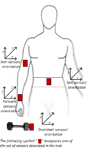
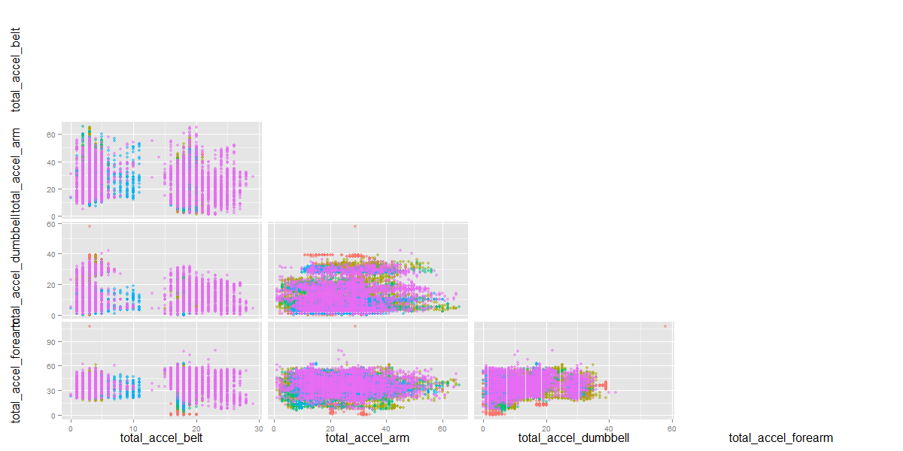
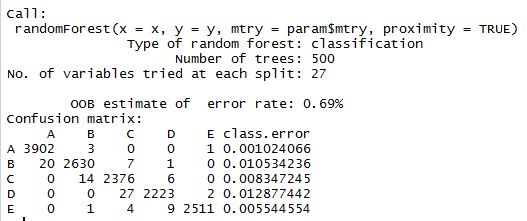
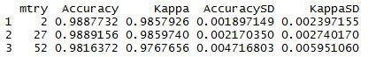
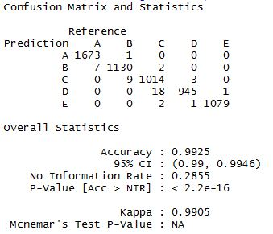

> Executive summary

This paper describes the training of a predictive model, using Random Forest algorithms, to predict the quality category of a series of exercises executed by six young health participants,  tasked to perform one set of 10 repetitions of the Unilateral Dumbbell Biceps Curl in five different fashions [Page link](http://groupware.les.inf.puc-rio.br/har#ixzz3gzuTdyIy):

**Class A** - according to the specification; **Class B** - throwing the elbows to the front; **Class C** - lifting the dumbbell only halfway; **Class D** - lowering the dumbbell only halfway; **Class E** - throwing the hips to the front.

during the experiment four different sensors were used to capture the activity movements:



Images and data reference *Velloso, E.; Bulling, A.; Gellersen, H.; Ugulino, W.; Fuks, H. Qualitative Activity Recognition of Weight Lifting Exercises. Proceedings of 4th International Conference in Cooperation with SIGCHI (Augmented Human '13) . Stuttgart, Germany: ACM SIGCHI, 2013.*


> Training and test sets downloading and loading of required libraries

```{r, warning=FALSE, message=FALSE, results='hide', cache =TRUE}
# downloading and loading the training set
        dataSource <- "https://d396qusza40orc.cloudfront.net/predmachlearn/pml-training.csv"
        download.file(url = dataSource, destfile = "pml-training.csv", mode = 'wb', method = "curl")
        trainData <- read.csv("pml-training.csv", header = TRUE, stringsAsFactors = TRUE) 

# downloading and loading the test set
        dataSource <- "https://d396qusza40orc.cloudfront.net/predmachlearn/pml-testing.csv"
        download.file(url = dataSource, destfile = "pml-testing.csv", mode = 'wb', method = "curl")
        testData <- read.csv("pml-testing.csv", header = TRUE, stringsAsFactors = TRUE)
        
# loading required packages
library(ggplot2)
library(GGally)
library(dplyr)
library(caret)
set.seed(123)
```

> Exploratory analysis

The testing set is a large database containing 160 variables (1 class output) and 19622 observations describing a series of exercises executed according to a class type, as described above. The sample is relatevely evenly distributed between users and classes.

```{r, cache=TRUE, results='hold'}
dim(trainData)
# table of users vs classes
with(trainData, table(user_name, classe))
```

A quick look at some key summary variables **(Total_accel_[sensor position])** shows evident regions and patterns for each activity class. This is a good thing, as this shows that a classifier would be able to identify and predict the different classes based on available variables. Furthermore, the chart shows no major multicollinearity between such predictors.

```{r, eval=FALSE}
# correlation matrix by classe
total <- names(select(trainData, starts_with("total")))
df <- data.frame(trainData[,total], trainData$classe)
ggpairs(df, columns = 1:4, upper = "blank", lower = list(continuos = "points"), diag = "blank", colour = "trainData.classe", alpha = .5)
```


> Data preparation

In order to select the minimun amount of significant variables, the following criteria was used to discard non value adding predictors. This left us with 53 relevant predictors:

1. Variables with very few unique values (nearZeroVar)
2. variables with more than 50% incomplete data (NA > 50%)
3. Variables with unique idenitfiers - use for experiment tracking records (e.g. user_name, time_stamp)

```{r, eval=FALSE}
# Data wrangling
        # Discart nearZeroVar
        zeroV <- nearZeroVar(trainData)
        trainData[,zeroV] <- list(NULL)
        # Discart cols with na > 50%
        col_na <- names(trainData[, colSums(is.na(trainData)) > nrow(trainData)*.5])
        trainData[,col_na] <- list(NULL)
        # Discart cols with unique identifiers
        trainData[,1:6]<- list(NULL)
        # Check any NA left
        sum(apply(is.na(trainData), 2, sum))
```

> Modeling

Being a classification problem, Decision Tress inmediatly came up as a preferable option. However, after trying some simple (but quick) Tree models (rtree and party) with very little accuracy < 50%, I opted for the more robust Random Forest algorithm, which basically averages the best predictions from many underliying decision trees. 

The Random Forest algorithm, boosted accuracy at the expense of speed, interpretability and overfit risk (however, for this simple once-off exercise it was a very good option).

```{r, eval=FALSE}
# Spliting data (test vs. validation)
inTrain <- createDataPartition(y=trainData$classe,
                               p = .7, list = FALSE)
trng <- trainData[inTrain,]
tstg <- trainData[-inTrain,]

# Training the model Random Forest
fit <- train(classe ~., data = trng, method = "rf", prox = TRUE)
```

> Cross validation and Generalisation error - Out of Bag (OOB) error

As stated by Emmert-Streind *et al*  (Medical Biostatistics for Complex Diseases, 2010) when random forests is used, "there is no need for cross-validation or a separate test set to get an unbiased estimate of the test set error **[as] it is estimated internally, during the run".** Basically, each tree is built using a different sample with replacement from the training set. Therefore ~1/3 of the observations are left out, and not used in the construction of the next tree. **Process that "has proven to be unbiased in many tests".** [Link](https://books.google.co.za/books?id=FgzAvzL2ibEC&pg=PA337&lpg=PA337&dq=%22In+random+forests,+there+is+no+need+for+cross-validation+or+a+separate+test+set+to+get+an+unbiased+estimate+of+the+test+set+error.+It+is+estimated+internally%22&source=bl&ots=XsuKJbL4ba&sig=PXkjKoWvnlMAA-IpuVSTK1i-YPs&hl=en&sa=X&ved=0CCgQ6AEwAmoVChMI74O52v34xgIVRlwUCh0EXADA#v=onepage&q=%22In%20random%20forests%2C%20there%20is%20no%20need%20for%20cross-validation%20or%20a%20separate%20test%20set%20to%20get%20an%20unbiased%20estimate%20of%20the%20test%20set%20error.%20It%20is%20estimated%20internally%22&f=false).

Hence, the RF process creates a good estimate of the expected out of sample error or **out-of-bag error, which in this case came to an average of just 0.69%, and an Accuracy average of 99% over a number of 27 variables tried at each split**.

```{r, eval=FALSE}
fit$finalModel
fit$results
# Pictures of the summary were used, as due to time constraints the model was only trained once on the R console


```


> Predictions on the test data

The model provided a highly **significant accuracy of 99% against the test set**. and a 20/20 score was achieved on the "quiz test data".

```{r, eval=FALSE}
pred <- predict(fit, tstg)
confusionMatrix(tstg$classe, pred)
# Pictures of the summary were used, as due to time constraints the model was only trained once on the R console

```


Previously applied criteria for predictors selection was execued on test - quiz data.

```{r, eval=FALSE}
# Data wrangling for quiz set
# Discart nearZeroVar
testData[,zeroV] <- list(NULL)
# Discart cols with na > 50%
testData[,col_na] <- list(NULL)
# Discart cols with unique identifiers
testData[,1:6]<- list(NULL)
# Check any NA left
sum(apply(is.na(trainData), 2, sum))
# Predict test data
pred_test <- predict(fit, testData)

# writing down the answers
pml_write_files <- function(x){
        n = length(x)
        for(i in 1:n){
                filename = paste0("problem_id_",i,".txt")
                write.table(x[i],file=filename,quote=FALSE,row.names=FALSE,col.names=FALSE)
        }
}
# writing file
pml_write_files(pred_test)
```

